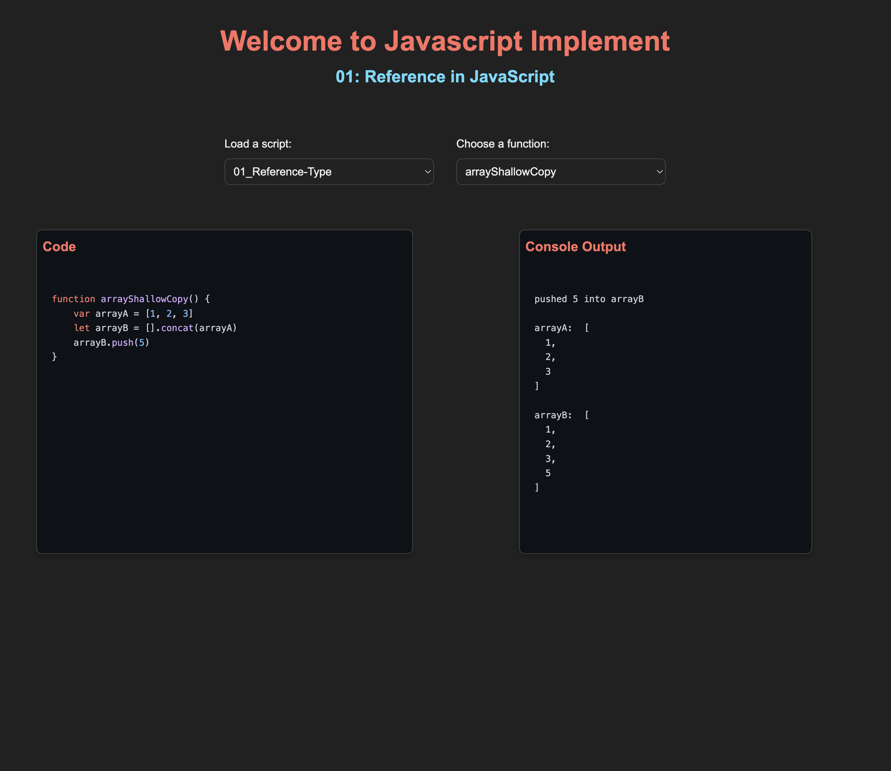

# Welcome to JS-Implement

This is a demo project showcasing an automated web application that allows users to select which JavaScript script files to run and specify the functions within those scripts to execute.

The purpose of this demo is for personal learning and experimentation with JavaScript. Typically, when testing or exploring JavaScript concepts learned from books or online, we often have to execute all functions in a script or manually comment out the ones we don't want to run at the moment. This process can be time-consuming and tedious.

This demo addresses that common challenge by streamlining the process, reducing manual operations, and enabling users to focus solely on writing and testing code. Essentially, it functions as a dynamic notebook for JavaScript learning.

